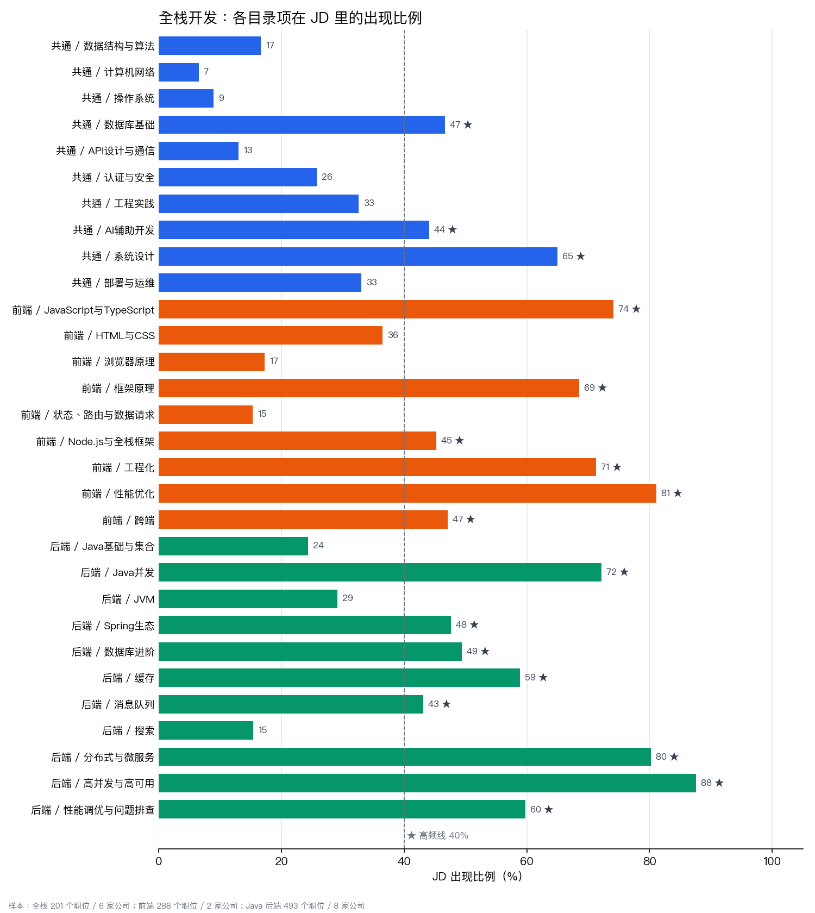
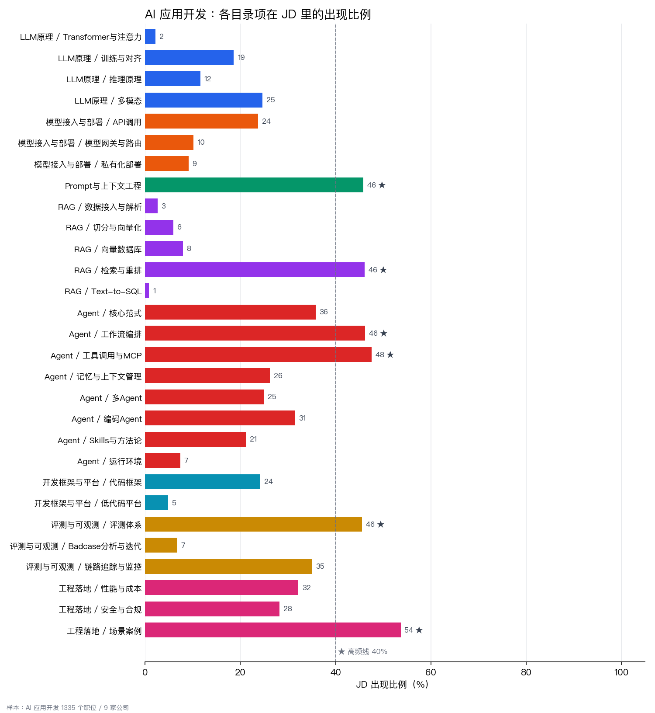

# 面试复习笔记

[](LICENSE)

面向两类岗位的面试复习笔记：

- **产品**：以 **AI 产品**为主。
- **技术**：**全栈开发**（前端 + Java 后端）和 **AI 应用开发**。

目录结构不是凭感觉定的：分类参考了 [Full-Stack Top-K](https://github.com/sigangluo/github-fullstack-topk) 和 [AI Top-K](https://github.com/sigangluo/github-ai-topk) 两份 GitHub 项目图谱，取舍和高频标注（★）依据 9 家互联网公司的社招 JD 统计，数据来自 [社招职位看板](https://sigangluo.github.io/cn-tech-jobs/)（2026-09-30）。

> 笔记正在陆续补充中，目前每个文件只写了考点范围。

## 目录设计

1. **第一层按岗位分。** 技术和产品面试考的东西不同，同一段项目经历在两类岗位的讲法也不同，所以 `技术/`、`产品/` 各有一份 `通用面试/`（简历、项目讲述、行为面试、HR 面）。
2. **技术分两个方向。** `全栈开发/` 下分 `共通/`（前后端都要学）、`前端/`、`后端/`；编程语言归到各自方向，Java 在 `后端/`，JavaScript / TypeScript 在 `前端/`。`AI 应用开发/` 按 LLM 原理 → 模型接入 → Prompt → RAG → Agent → 框架 → 评测 → 落地组织。
3. **产品以 AI 产品为主体。** `AI产品/` 放 AI 产品特有的能力，`产品基本功/`、`数据能力/` 是支撑；要懂什么放在知识目录，怎么答放在 `面试题型/`。
4. **同一个知识点只写一处。** 交叉的地方用链接：`产品/AI产品/技术理解` 只写产品需要懂到的程度，原理链接到 `技术/AI应用开发/`；`共通/AI辅助开发`（怎么用 AI 编程工具）和 `Agent/编码Agent`（它们怎么实现）互相链接。
5. **面经单独放。** `面经与复盘/` 按一场场面试记录，复盘出的薄弱点再链接回对应的知识文件。

## 数据支撑

每个目录项对应一组关键词，统计它在对应岗位 JD（职位描述 + 任职要求）里的出现比例：每家公司单独算、再对公司取平均，只统计样本数 ≥ 8 的公司，避免职位最多的一家主导结果。≥ 40% 的目录项标 ★。

**关键词出现在 JD 里 ≠ 面试考不考。** 计算机网络、操作系统、Transformer 原理这类默认要会的内容很少写进 JD，比例低也照样要准备；★ 只用来排复习的先后。

### AI 已经是各类岗位的默认要求


- 全栈岗 93% 提到 AI、69% 提到 Agent，57% 要求会用 AI 编程工具，所以「全栈 + AI 应用开发」这个组合是成立的，`共通/` 里单独有 `AI辅助开发`。
- 产品岗整体 62% 提到 AI，这是 `产品/` 以 AI 产品为主体的原因。

### 全栈开发



- 后端最重的是高并发与高可用（88%）、分布式与微服务（80%）、Java 并发（72%）、性能调优与问题排查（60%），后两项和「高并发与高可用」都是单独拆出来的。
- 前端的性能优化（81%）、工程化（71%）、框架（69%）最高；跨端（47%）和 Node.js（45%）也过了高频线，所以各自独立成项。
- 共通部分只有系统设计、数据库、AI 辅助开发过线；网络、操作系统在 JD 里不到 10%，但面试基础题常问。

### AI 应用开发



- 高频的是工具调用与 MCP、Prompt 与上下文工程、RAG、工作流编排、评测（都在 46%～48%），外加业务场景落地（54%）。评测因此单独成一个目录。
- RAG 的子项（解析、切分、向量库）在 JD 里很少单独写，JD 通常只写「RAG」，所以都算在「检索与重排」上；面试时仍会顺着 RAG 链路逐环追问。
- 运行环境（浏览器自动化、沙箱）只有 7%，合并成一项；低代码平台 5%，保留但优先级低。

### 产品


- AI 产品岗最看重的是跨团队协作（89%）、场景挖掘（78%）、规划与策略（73%）、体验设计（65%）、与算法团队协作（58%）。
- 技术理解（52%）和效果评测（49%）都过了高频线，是 AI 产品和传统产品岗最不一样的地方。
- AB 实验（15%）、SQL（8%）比例低，保留但放在后面。

重新生成这些图：

```bash
pip install matplotlib
python3 scripts/jd_analysis.py [数据目录]    # 数据目录默认 ../求职/data，格式为 <公司>/技术.csv、<公司>/产品.csv
```

CSV 可以在 [社招职位看板](https://sigangluo.github.io/cn-tech-jobs/) 页面底部下载。

## 完整目录

每个叶子项是一个 Markdown 文件。★ 表示在对应岗位 JD 里出现比例 ≥ 40%。

```
面试/
├── 技术/
│   ├── 通用面试/
│   │   ├── 简历与自我介绍
│   │   ├── 项目经历讲述稿
│   │   ├── 行为面试
│   │   └── HR面与谈薪
│   ├── 全栈开发/
│   │   ├── 共通/
│   │   │   ├── 数据结构与算法
│   │   │   ├── 计算机网络
│   │   │   ├── 操作系统
│   │   │   ├── 数据库基础 ★
│   │   │   ├── API设计与通信
│   │   │   ├── 认证与安全
│   │   │   ├── 工程实践
│   │   │   ├── AI辅助开发 ★
│   │   │   ├── 系统设计 ★
│   │   │   └── 部署与运维
│   │   ├── 前端/
│   │   │   ├── JavaScript与TypeScript ★
│   │   │   ├── HTML与CSS
│   │   │   ├── 浏览器原理
│   │   │   ├── 框架原理 ★
│   │   │   ├── 状态、路由与数据请求
│   │   │   ├── Node.js与全栈框架 ★
│   │   │   ├── 工程化 ★
│   │   │   ├── 性能优化 ★
│   │   │   └── 跨端 ★
│   │   └── 后端/
│   │       ├── Java基础与集合
│   │       ├── Java并发 ★
│   │       ├── JVM
│   │       ├── Spring生态 ★
│   │       ├── 数据库进阶 ★
│   │       ├── 缓存 ★
│   │       ├── 消息队列 ★
│   │       ├── 搜索
│   │       ├── 分布式与微服务 ★
│   │       ├── 高并发与高可用 ★
│   │       └── 性能调优与问题排查 ★
│   └── AI应用开发/
│       ├── LLM原理/
│       │   ├── Transformer与注意力
│       │   ├── 训练与对齐
│       │   ├── 推理原理
│       │   └── 多模态
│       ├── 模型接入与部署/
│       │   ├── API调用
│       │   ├── 模型网关与路由
│       │   └── 私有化部署
│       ├── Prompt与上下文工程 ★
│       ├── RAG/
│       │   ├── 数据接入与解析
│       │   ├── 切分与向量化
│       │   ├── 向量数据库
│       │   ├── 检索与重排 ★
│       │   └── Text-to-SQL
│       ├── Agent/
│       │   ├── 核心范式
│       │   ├── 工作流编排 ★
│       │   ├── 工具调用与MCP ★
│       │   ├── 记忆与上下文管理
│       │   ├── 多Agent
│       │   ├── 编码Agent
│       │   ├── Skills与方法论
│       │   └── 运行环境
│       ├── 开发框架与平台/
│       │   ├── 代码框架
│       │   └── 低代码平台
│       ├── 评测与可观测/
│       │   ├── 评测体系 ★
│       │   ├── Badcase分析与迭代
│       │   └── 链路追踪与监控
│       └── 工程落地/
│           ├── 性能与成本
│           ├── 安全与合规
│           └── 场景案例 ★
├── 产品/
│   ├── 通用面试/
│   │   ├── 简历与自我介绍
│   │   ├── 项目经历讲述稿
│   │   ├── 行为面试
│   │   └── HR面与谈薪
│   ├── AI产品/
│   │   ├── 技术理解 ★
│   │   ├── 场景挖掘与需求判断 ★
│   │   ├── 体验与交互设计 ★
│   │   ├── Prompt与原型搭建
│   │   ├── 效果评测与迭代 ★
│   │   ├── 与算法团队协作 ★
│   │   ├── 商业化与成本
│   │   └── 安全与合规
│   ├── 产品基本功/
│   │   ├── 需求分析与用户研究
│   │   ├── 产品设计与PRD ★
│   │   ├── 产品规划与策略 ★
│   │   └── 项目推进与跨团队协作 ★
│   ├── 数据能力/
│   │   ├── 指标体系 ★
│   │   ├── 数据分析方法 ★
│   │   ├── AB实验
│   │   └── SQL
│   ├── AI行业与竞品/ ★              模型厂商格局、AI 应用分类，各家产品拆解按公司另建文件
│   └── 面试题型/
│       ├── 产品分析题
│       ├── AI产品设计题
│       ├── 数据分析题
│       └── 估算题
├── 面经与复盘/
│   ├── 技术/
│   └── 产品/
├── scripts/jd_analysis.py            生成上面的统计图
└── docs/images/                      统计图
```

## 约定

- 每个文件开头的「范围」写明这个文件管什么，内容超出范围就放到对应文件里再链接过去。
- 简历原文、真实薪资这类隐私内容写在同目录的 `*.private.md` 里，已被 `.gitignore` 忽略，不会提交。
- 面经的记录方式见 [面经与复盘/README.md](面经与复盘/README.md)。

## 许可证

本仓库内容采用 [CC BY-NC-SA 4.0](LICENSE)：可以自由转载和改编，但需要署名、不得用于商业用途，改编后以相同协议发布。
