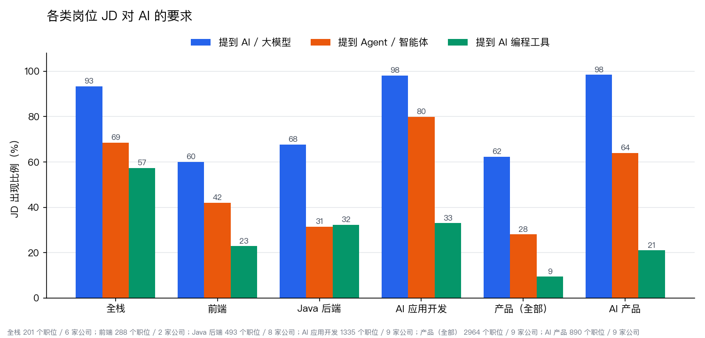
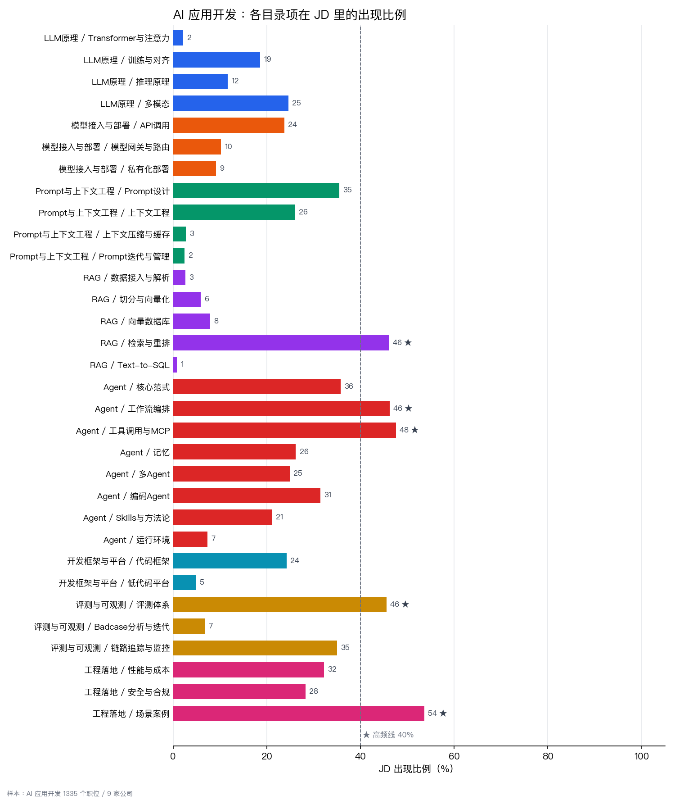
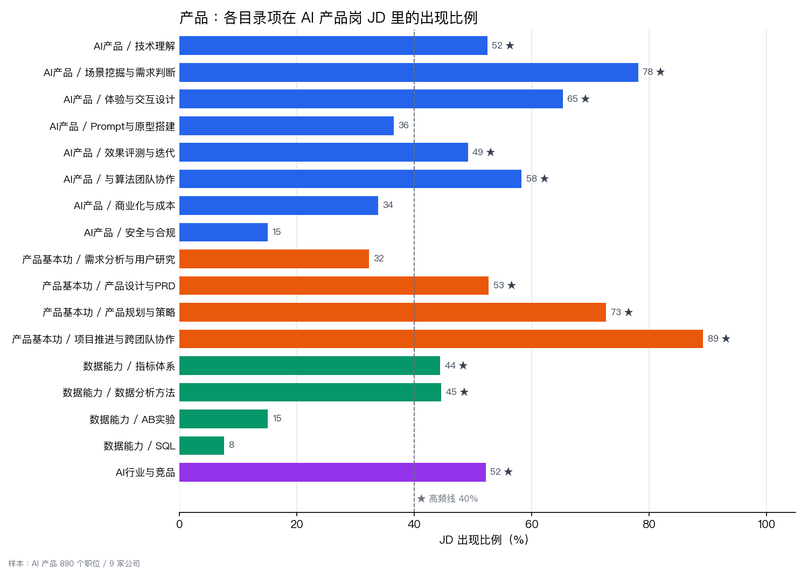

# 面试复习笔记

[](LICENSE)

面向两类岗位：**产品**（以 AI 产品为主）和**技术**（全栈开发、AI 应用开发）。笔记正在陆续补充，目前每个文件只写了考点范围。

## 目录怎么设计的

1. **第一层按岗位分。** 技术和产品面试考的东西不同，同一段项目经历讲法也不同，所以 `技术/`、`产品/` 各有一份 `通用面试/`（简历、项目讲述、行为面试、HR 面）。
2. **技术分两个方向。** `全栈开发/` 下分 `共通/`（前后端都要学）、`前端/`、`后端/`，编程语言归到各自方向。`AI应用开发/` 按 LLM 原理、模型接入、Prompt、RAG、Agent、框架、评测、落地组织。
3. **产品以 AI 产品为主体。** `AI产品/` 放 AI 产品特有的能力，`产品基本功/`、`数据能力/` 是支撑；要懂什么放知识目录，怎么答放 `面试题型/`。
4. **同一个知识点只写一处，用链接引用。** 正文里用普通 Markdown 链接指向另一篇笔记，笔记底部会自动列出「引用」和「被引用」，全部引用关系在站点的「关联」页查看。
5. **面经单独放。** `面经与复盘/` 按一场场面试记录，复盘出的薄弱点再链接回对应的知识文件，记录格式见 [面经与复盘/README.md](面经与复盘/README.md)。

分类参考了 [Full-Stack Top-K](https://github.com/sigangluo/github-fullstack-topk) 和 [AI Top-K](https://github.com/sigangluo/github-ai-topk) 两份 GitHub 项目图谱，取舍依据 9 家互联网公司的社招 JD（[社招职位看板](https://sigangluo.github.io/cn-tech-jobs/)，2026-09-30）。

```
技术/                          产品/                        面经与复盘/
├── 通用面试/                  ├── 通用面试/                ├── 技术/
├── 全栈开发/                  ├── AI产品/                  └── 产品/
│   ├── 共通/                  ├── 产品基本功/
│   ├── 前端/                  ├── 数据能力/
│   └── 后端/                  ├── AI行业与竞品/
└── AI应用开发/                └── 面试题型/
```

## 数据支撑

每个目录项对应一组关键词，统计它在对应岗位 JD 里的出现比例：每家公司单独算、再对公司取平均，只统计样本数 ≥ 8 的公司。≥ 40% 标 ★，用来排复习的先后。**JD 没写不等于不考**：计算机网络、操作系统、Transformer 原理这类默认要会的内容很少出现在 JD 里，比例低也照样要准备。统计方法和关键词都在 [`tools/scripts/jd_analysis.py`](tools/scripts/jd_analysis.py) 里，图可以重新生成：

```bash
pip install matplotlib
python3 tools/scripts/jd_analysis.py [数据目录]    # 默认 ../../求职/data，格式为 <公司>/技术.csv、<公司>/产品.csv
```

### AI 已经是各类岗位的默认要求



全栈岗 93% 提到 AI、69% 提到 Agent，57% 要求会用 AI 编程工具，所以「全栈 + AI 应用开发」这个组合是成立的，`共通/` 里单独有 `AI辅助开发`。产品岗整体 62% 提到 AI，这是 `产品/` 以 AI 产品为主体的原因。

### 全栈开发


后端最重的是高并发与高可用（88%）、分布式与微服务（80%）、Java 并发（72%）、性能调优（60%），后两项和「高并发与高可用」都是单独拆出来的。前端的性能优化（81%）、工程化（71%）、框架（69%）最高，跨端（47%）和 Node.js（45%）也各自独立成项。共通部分只有系统设计、数据库、AI 辅助开发过了高频线。

### AI 应用开发



高频的是工具调用与 MCP、RAG、工作流编排、评测（都在 46%～48%），外加业务场景落地（54%），评测因此单独成一个目录；Prompt 设计（35%）和上下文工程（26%）紧随其后。RAG 和 Prompt 的细分子项（切分、向量库、上下文压缩、Prompt 迭代）在 JD 里很少单独写，通常只写「RAG」「Prompt」，但面试会顺着整条链路追问。浏览器自动化、沙箱只有 7%，合并成「运行环境」。

### 产品



AI 产品岗最看重跨团队协作（89%）、场景挖掘（78%）、规划与策略（73%）、体验设计（65%）、与算法团队协作（58%）。技术理解（52%）和效果评测（49%）都过了高频线，是 AI 产品和传统产品岗最不一样的地方。AB 实验（15%）、SQL（8%）比例低，保留但放在后面。

## 在线阅读

笔记可以在站点上浏览（左侧目录、搜索、深色模式）：**<https://sigangluo.github.io/interview-notes/>**

Markdown 是内容来源，`site/` 只负责展示，两者通过生成的数据文件连接：

```bash
python3 tools/scripts/build_site.py    # 扫描 技术/、产品/、面经与复盘/，生成 site/data/notes.json
python3 -m http.server -d site 8000    # 本地预览 http://localhost:8000（不能直接双击 html 打开）
```

推送到 `main` 后，`.github/workflows/deploy-pages.yml` 会把 `site/` 部署到 GitHub Pages（仓库 Settings → Pages 的 Source 需设为 GitHub Actions）。`*.private.md` 不会被扫描进去。

## 约定

- 每个文件开头的「范围」写明这个文件管什么，内容超出范围就放到对应文件里再链接过去。
- 简历原文、真实薪资、不想公开的面经写成同目录的 `*.private.md`，已被 `.gitignore` 忽略，不会提交。

## 许可证

采用 [CC BY-NC-SA 4.0](LICENSE)：可以自由转载和改编，但需要署名、不得用于商业用途，改编后以相同协议发布。
